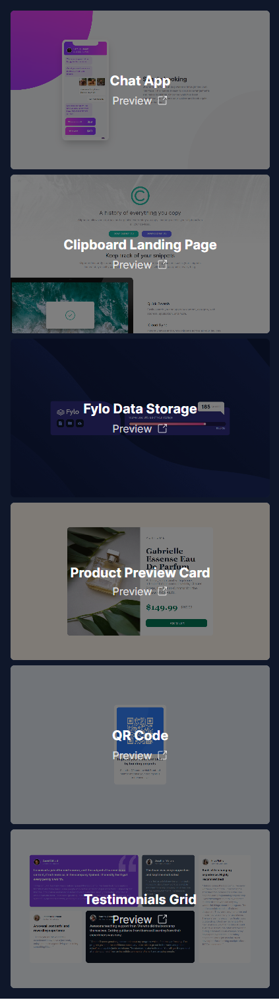
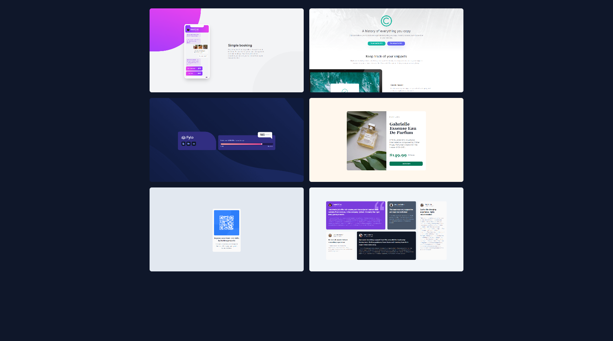

  

<h1 align="center">Frontend Mentor Solutions</h1>

## Table of contents

- [Table of contents](#table-of-contents)
- [About](#about)
- [Screenshots](#screenshots)
- [Built with](#built-with)
- [Links](#links)
- [License](#license)

## About

This repository contains all of my solutions to challenges from Frontend Mentor. Made with React, TailwindCSS and NextJS. Fully functional, fully responsive.

## Screenshots

## Built with

## Links

- [Live Preview](https://frontend-mentor-solutions-three.vercel.app/)

## License

This project is licensed under the [MIT License](./LICENSE).

<a href="#readme-top"><strong>Back to top</strong></a>

