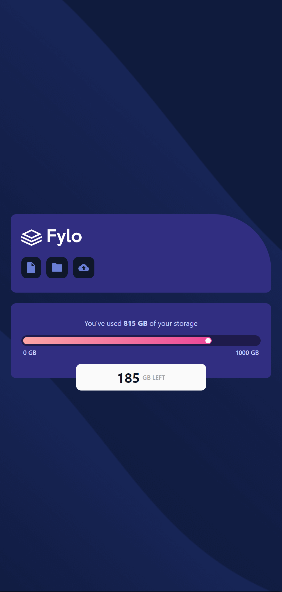
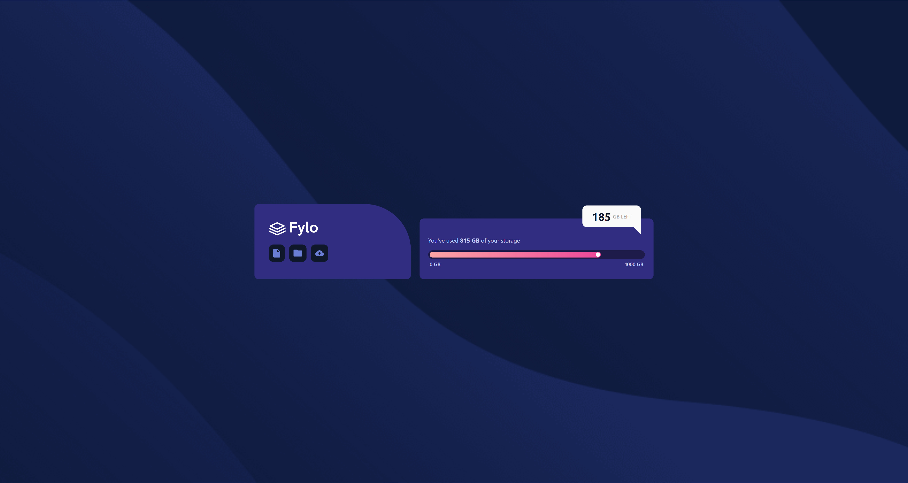

<h1 align="center">Fylo data storage component solution - Frontend Mentor</h1>

## Table of contents

- [Table of contents](#table-of-contents)
- [About](#about)
- [Screenshots](#screenshots)
- [Built with](#built-with)
- [Links](#links)
- [License](#license)

## About

This is a solution to the [Fylo data storage component challenge on Frontend Mentor](https://www.frontendmentor.io/challenges/fylo-data-storage-component-1dZPRbV5n). Frontend Mentor challenges help you improve your coding skills by building realistic projects.

## Screenshots

## Built with

## Links

- [Live Preview](https://seesmof.github.io/fylo-data-storage-component/)
- [Frontend Mentor Solution URL](https://www.frontendmentor.io/solutions/responsive-with-tailwindcss-vlv9olWCQN)

## License

This project is licensed under the [MIT License](./LICENSE).

<a href="#readme-top"><strong>Back to top</strong></a>

