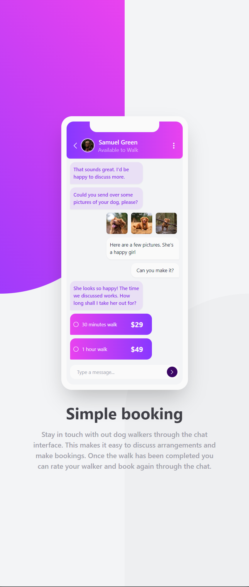
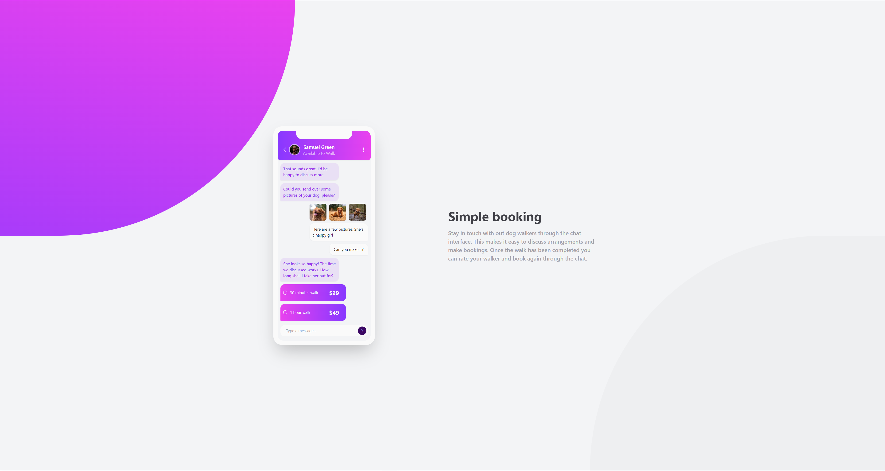

# Frontend Mentor - Chat app CSS illustration solution

This is a solution to the [Chat app CSS illustration challenge on Frontend Mentor](https://www.frontendmentor.io/challenges/chat-app-css-illustration-O5auMkFqY). Frontend Mentor challenges help you improve your coding skills by building realistic projects.

## Table of contents

- [Frontend Mentor - Chat app CSS illustration solution](#frontend-mentor---chat-app-css-illustration-solution)
  - [Table of contents](#table-of-contents)
  - [Screenshots](#screenshots)
  - [Links](#links)
  - [Built with](#built-with)
  - [Author](#author)

## Screenshots

## Links

- Solution URL: [solution URL](https://www.frontendmentor.io/solutions/responsive-with-tailwindcss-9O6zF2Pwjf)
- Live Site URL: [live site URL](https://seesmof.github.io/chat-app-css-illustration/)

## Built with

- HTML
- TailwindCSS

## Author

- Website - [@seesmof](https://github.com/seesmof)
- Frontend Mentor - [@seesmof](https://www.frontendmentor.io/profile/seesmof)
