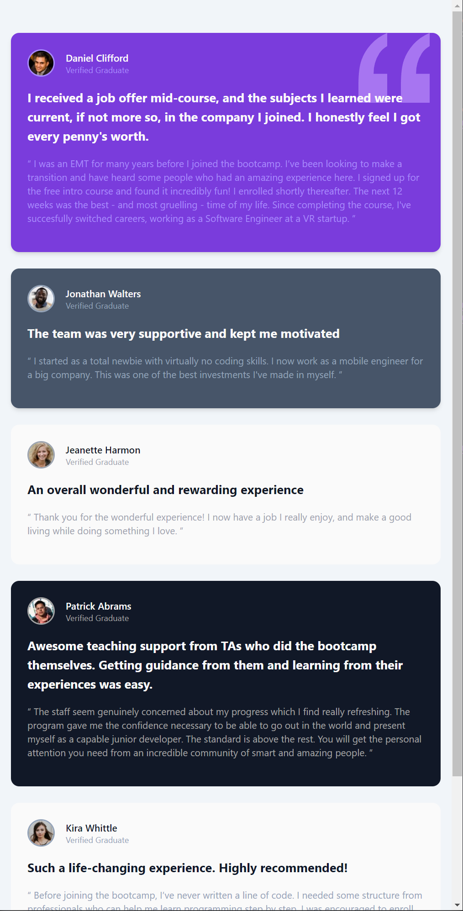

# Frontend Mentor - Testimonials grid section solution

This is a solution to the [Testimonials grid section challenge on Frontend Mentor](https://www.frontendmentor.io/challenges/testimonials-grid-section-Nnw6J7Un7). Frontend Mentor challenges help you improve your coding skills by building realistic projects.

## Table of contents

- [Frontend Mentor - Testimonials grid section solution](#frontend-mentor---testimonials-grid-section-solution)
  - [Table of contents](#table-of-contents)
  - [Screenshots](#screenshots)
  - [Links](#links)
  - [Built with](#built-with)
  - [Author](#author)

## Screenshots

## Links

- [Solution URL](https://www.frontendmentor.io/solutions/responsive-with-tailwindcss-w85VzY60YF)
- [Live Site URL](https://seesmof.github.io/testimonials-grid-section/)

## Built with

## Author

- Website - [@seesmof](https://github.com/seesmof)
- Frontend Mentor - [@seesmof](https://www.frontendmentor.io/profile/seesmof)
